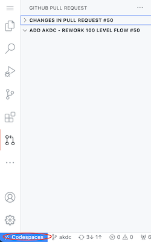
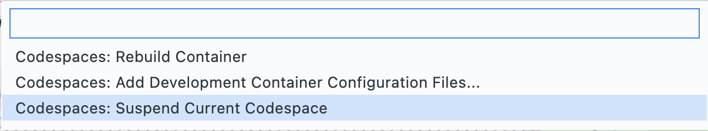
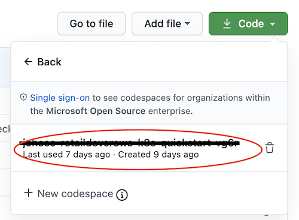
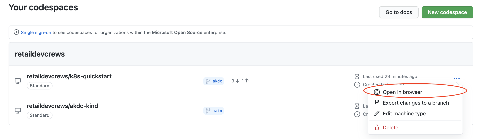

# Session 1: Setup Codespaces Lab

> Purpose: Set up `GitHub Codespace` to use for this lab series

## Lab Resources

- For these labs, we will be using [GitHub Codespaces](https://github.com/features/codespaces)
- [Docs](https://docs.github.com/en/github/developing-online-with-codespaces/configuring-codespaces-for-your-project) for Configuring Codespaces for your project
- GitHub Codespaces [Walkthrough Video](https://msit.microsoftstream.com/video/5117a1ff-0400-85a8-40e1-f1eb81434a69?channelId=a60fa4ff-0400-85a8-733a-f1eb81fa8f8d) (Microsoft Internal)

## Open with Codespaces

- Navigate to the [this](https://github.com/retaildevcrews/k8s-quickstart) repo
- Click the green `Code` button
- Click `Open with Codespaces`
- Click `New Codespace`


## Verify Codespace

Validate docker is running

```bash

docker -v

```

Validate kind was installed

```bash

kind --version

```

## Stop Codespaces

> Codespaces will automatically stop after 30 minutes of inactivity

To manually stop Codespaces

- On the lower left corner, select the `Codespaces` with the blue background



- A dropdown will appear at the top of the screen. Select `Codespaces: Stop Current Codespace`



## Restart Codespace

### Restart from GitHub Repo

To restart a Codespace from the GitHub Repo

- Navigate to the [k8s-quickstart](https://github.com/retaildevcrews/k8s-quickstart) repo
- Click the green `Code` button
- Click `Open with Codespaces`
- Select previously created Codespaces



### Restart from Your Codespaces

To restart a Codespace from [Your Codespaces](https://github.com/codespaces)

- To the right of the Codespaces you'd like to restart, click the 3 dots (•••)
- From the dropdown, select `Open in browser`



## Delete Codespace

To delete a Codespace from [Your Codespaces](https://github.com/codespaces)

- To the right of the Codespace you'd like to delete, click the 3 dots (•••)
- From the dropdown, select `Delete`


