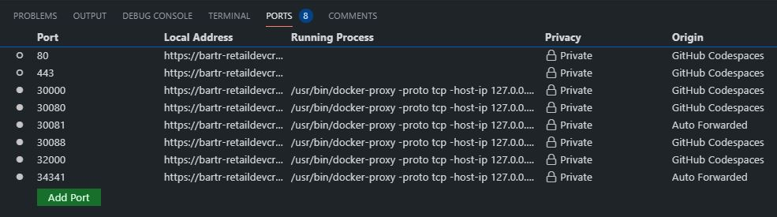

# Session 4: Kubernetes Kind Cluster Lab

This is a `hands-on lab` and assumes familiarity with basic Kubernetes. Please use the links below for basic familiarity.

## Kubernetes Introduction

- Overview of Kubernetes: <https://kubernetes.io/docs/concepts/overview/what-is-kubernetes/>
- The Illustrated Children's Guide to Kubernetes: <https://www.youtube.com/watch?v=4ht22ReBjno/>
- What the Hack - Intro to Kubernetes: <https://github.com/Microsoft/WhatTheHack/tree/master/001-IntroToKubernetes/>
- Video [walkthrough](https://msit.microsoftstream.com/video/5117a1ff-0400-85a8-40e1-f1eb81434a69?channelId=a60fa4ff-0400-85a8-733a-f1eb81fa8f8d) of a Kind cluster in GitHub Codespaces (Microsoft Internal)

## Lab Introduction

- For these labs, we will be using [GitHub Codespaces](https://github.com/features/codespaces) and [KIND](https://kind.sigs.k8s.io/) to create a `Development Cluster`
- For `production clusters` please see the [AKS documentation](https://docs.microsoft.com/en-us/azure/aks/)

### Create a Kind Cluster

`Kind` is already installed in your GitHub Codespace

Create a Kind cluster and deploy the NGSA stack

```bash

make all

```

After the cluster is created, check the cluster with `kubeadm`

```bash

k get po -A

```

Output

```bash

NAMESPACE            NAME                                         READY   STATUS
default              fluentb                                      1/1     Running
default              jumpbox                                      1/1     Running
default              loderunner                                   1/1     Running
default              ngsa-memory                                  1/1     Running
kube-system          coredns-74ff55c5b-nbgfp                      1/1     Running
kube-system          coredns-74ff55c5b-tq5nm                      1/1     Running
kube-system          etcd-kind-control-plane                      1/1     Running
kube-system          kindnet-fnt5x                                1/1     Running
kube-system          kube-apiserver-kind-control-plane            1/1     Running
kube-system          kube-controller-manager-kind-control-plane   1/1     Running
kube-system          kube-proxy-rqbz4                             1/1     Running
kube-system          kube-scheduler-kind-control-plane            1/1     Running
local-path-storage   local-path-provisioner-78776bfc44-dtmbf      1/1     Running
monitoring           grafana-64f7dbcf96-kp4qs                     1/1     Running
monitoring           prometheus-deployment-67cbf97f84-x9lq6       1/1     Running

```

### Port Forwarding

Codespaces can forward ports so that you can access from your local browser. We have the following ports forarded:

Port | Service
---- | -------
30000 | Prometheus
30080 | NGSA application
30088 | LodeRunner (only /metrics and /version are vaild endpoints)
32000 | Grafana (login admin:Ngsa512)

Click on the `Ports` tab in Codespaces to forward the ports



### Further Learning

- Explore with k9s by running `k9s from the terminal`
- Explore the [Makefile](../Makefile)
- Explore the [YAML](../deploy)

### Delete the Cluster

```bash

make delete

```
