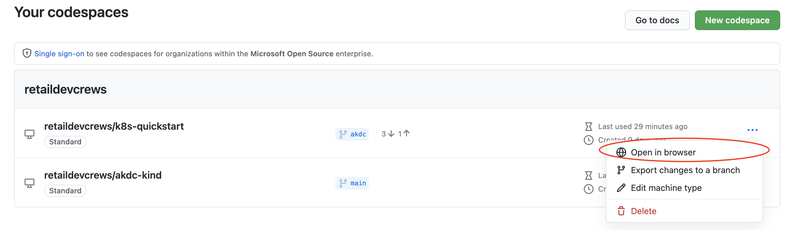

# Session 1: Setup Codespaces Lab

> Purpose: Set up the Codespaces environment to use for this lab series

TODO [MS Internal Link to Stream Walkthrough](https://msit.microsoftstream.com/group/f36284b8-cb9d-42b4-947e-9ac3e141aa74?view=highlights)

## Lab Resources

- For these labs, we will be using [GitHub Codespaces](https://github.com/features/codespaces)
- [Docs](https://docs.github.com/en/github/developing-online-with-codespaces/configuring-codespaces-for-your-project) for Configuring Codespaces for your project

## Open with Codespaces

- Navigate to the [k8s-quickstart](https://github.com/retaildevcrews/k8s-quickstart) repo
- Click the green `Code` button
- Click `Open with Codespaces`
- Click `New Codespace`


## Verify environment configs

Validate docker is running

```bash
docker -v
```

Validate kind was installed

```bash
kind --version
```

## Customize Codespaces

Configure the codespace environment for every new codespace created for this repository.
This can include frameworks, tools, extensions, and port forwarding.

```json
// .devcontainer/devcontainer.json
{
    "name": "k8s-qs",
    "image": "ghcr.io/retaildevcrews/kind", // docker image
    "runArgs": ["--init", "--privileged"], // docker cli arguments
    "overrideCommand": false, // runs containers default command
    
    // Set *default* container specific settings.json values on container create.
    "settings": {
        "terminal.integrated.shell.linux": "/bin/bash"
    },

    // Overrides the user that VS Code runs as in the container
    "remoteUser": "vscode",

    // Array of ports that should be forwarded from inside the container to the local machine
    "forwardPorts": [80, 8080, 30000, 32000, 30080, 30088],
    
    // Install extensions
    "extensions": [
        "davidanson.vscode-markdownlint", // Markdown linter
        "gruntfuggly.todo-tree", // Easily see comment tags like TODO and FIXME
        "ms-azuretools.vscode-docker", // Easily build, manage, and deployed containerized applications from Visual Studio Code
        "humao.rest-client" // Send HTTP request and view response in Visual Studio Code
    ],
    
    // Run Bash script in .devcontainer directory
    "postCreateCommand": "/bin/bash ./.devcontainer/post-install.sh"
}
```

The `postCreateCommand` in the `devcontainer.json` file executesthe following bash script.

```bash
# .devcontainer/post-install.sh

#!/bin/sh

# add kubectl completion
mkdir -p ~/.local
cp .devcontainer/kubectl_completion ~/.local/kubectl_completion

# update .bashrc with helpful aliases
pushd ~
echo "export PATH=$PATH:$HOME/.local/bin" >> .bashrc
echo "alias k='kubectl'" >> .bashrc
echo "alias ipconfig='ip -4 a show eth0 | grep inet | sed \"s/inet//g\" | sed \"s/ //g\" | cut -d / -f 1'" >> .bashrc
# Enable kubectl autocompletion
echo 'complete -F __start_kubectl k' >> .bashrc 
```

## Suspend Codespaces

> Codespaces will automatically suspend after 30 minutes of inactivity

To manually suspend Codespaces from Codepaces

- On the lower right-hand side, select the `Codespaces` with the blue background


- A dropdown will appear at the top of the screen. Select `Codespaces: Suspend Current Codespace`


## Restart Codespaces

### Restart from GitHub Repo

To restart suspended Codespaces from the GitHub Repo

- Navigate to the [k8s-quickstart](https://github.com/retaildevcrews/k8s-quickstart) repo
- Click the green `Code` button
- Click `Open with Codespaces`
- Select previously created Codespaces


### Restart from Your Codespaces

To restart suspended Codespaces from [Your Codespaces](https://github.com/codespaces)

- To the right of the Codespaces you'd like to restart, click the 3 dots (•••)
- From the dropdown, select `Open in browser`



## Delete Codespaces

### Delete from GitHub Repo

To delete suspended Codespaces from the GitHub Repo

- Navigate to the [k8s-quickstart](https://github.com/retaildevcrews/k8s-quickstart) repo
- Click the green `Code` button
- Click `Open with Codespaces`
- Click the trash can icon next to the Codespaces you'd like to delete


### Delete from Your Codespace

To delete suspended Codespaces from [Your Codespaces](https://github.com/codespaces)

- To the right of the Codespaces you'd like to restart, click the 3 dots (•••)
- From the dropdown, select `Delete`


